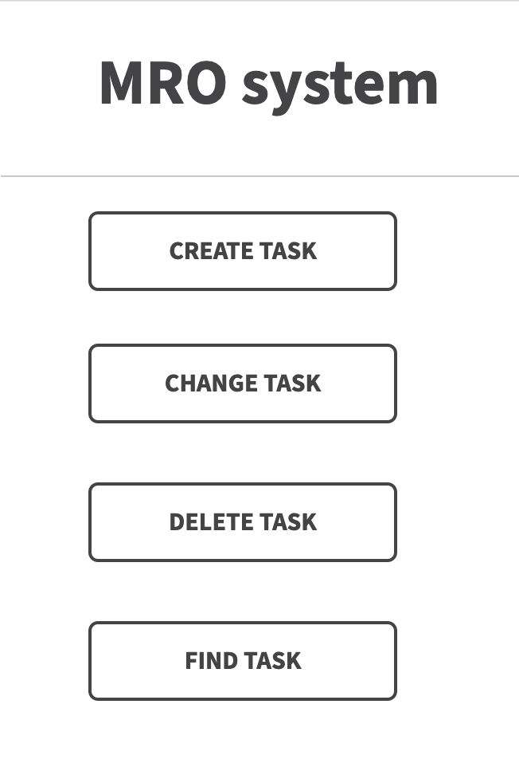

# OTUS Kotlin project

# SMEV ADAPTER

СМЭВ АДАПТЕР - это коробчное решение для реализации взаимодействия банковских сервисов со СМЭВ.
Задача решения - обеспечить быстрое развертывание системы в инфраструктуре клиента.

## Визуальная схема фронтенда

## Документация

1. Маркетинг
    1. [Заинтересанты](./docs/02-stakeholders.md)
    2. [Целевая аудитория](./docs/01-target-audience.md)
    3. [Конкурентный анализ](./docs/03-concurrency.md)
    4. [Анализ экономики](./docs/04-economy.md)
    5. [Пользовательские истории](./docs/05-user-stories.md)

   
